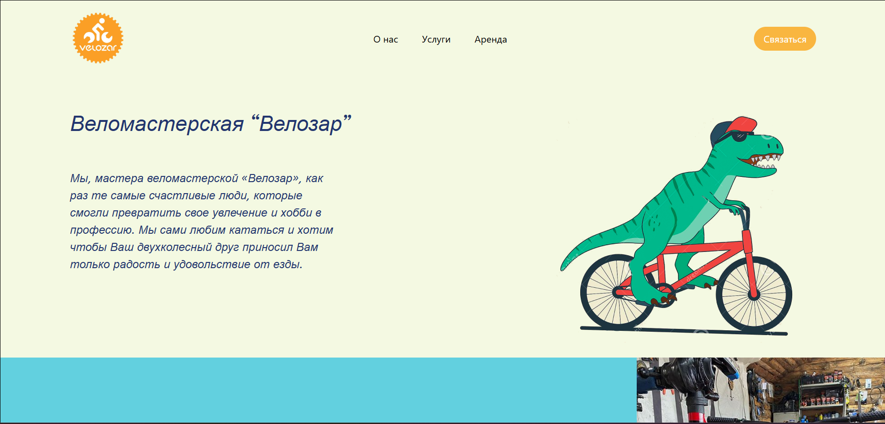

# React Landing Page — Component Practice

Учебный проект по разработке адаптивного лендинга с использованием React и Vite.  
Создан на 2 курсе колледжа в рамках изучения React.js и компонентного подхода.

---

## О проекте

Проект представляет собой одностраничное веб-приложение, реализованное на React по макету из Figma.

Основная цель — освоить компонентную архитектуру, научиться разбивать интерфейс на переиспользуемые элементы и реализовывать адаптивную вёрстку с использованием современных инструментов frontend-разработки.

Figma макет - https://www.figma.com/file/cNhWYz31BR98iJSqEfHDM0/ThriveTalk-Landing-Page-(Copy)-(Copy)?type=design&node-id=0%3A1&mode=design&t=ZjotSe7V7lIn969p-1

---

## Задача проекта

- сверстать лендинг по макету Figma с использованием React
- реализовать компонентную архитектуру приложения
- разбить интерфейс на переиспользуемые компоненты
- использовать props для передачи данных между компонентами
- применить flex/grid для построения layout
- организовать структуру проекта в соответствии с требованиями

---

## Демо

https://kirikiri2.github.io/react-vite-app/



---

## Функционал

- компонентная структура приложения
- переиспользуемые UI-компоненты
- передача данных через props
- адаптивная вёрстка

---

## Технологии

- React
- Vite
- JavaScript
- TailwindCSS

---

## Роль в проекте

Выполненные задачи:

- разработка структуры React-приложения
- проектирование дерева компонентов
- реализация компонентного подхода
- создание переиспользуемых UI-компонентов
- работа с props и передачей данных
- верстка интерфейса по макету Figma
- организация структуры проекта

---

## Что решает проект

Проект направлен на отработку ключевых навыков React-разработки:

- переход от статической вёрстки к компонентной архитектуре
- повторное использование компонентов
- разделение логики и представления
- структурирование frontend-приложения

---

## Практикуемые навыки

- основы React
- компонентный подход
- работа с props
- структурирование проекта
- адаптивная вёрстка
- работа с layout (flex/grid)
- перенос дизайна из Figma в React

---

## Структура проекта
```
react-vite-app/
├── public/
├── src/
│ ├── assets/
│ ├── components/
│ │ ├── blocks/
│ │ │ ├── HeroSection.jsx
│ │ │ ├── SecondSection.jsx
│ │ │ ├── ThirdSection.jsx
│ │ │ └── CardSection.jsx
│ │ └── ui/
│ │ ├── Header.jsx
│ │ ├── Button.jsx
│ │ ├── Text.jsx
│ │ ├── BlockText.jsx
│ │ ├── CardText.jsx
│ │ └── ANavTeg.jsx
│ ├── App.jsx
│ ├── main.jsx
│ ├── App.css
│ └── index.css
├── index.html
├── package.json
└── vite.config.js
```
---

## Установка и запуск проекта

### 1. Установка зависимостей

```
cd react-vite-app
npm install
```

### 2. Запуск проекта
```
npm run dev
```

### 3. Открыть в браузере
http://localhost:5173/

## Итог

Проект стал важным шагом в изучении React и помог сформировать понимание:

 - компонентной архитектуры
 - переиспользуемости кода
 - структуры frontend-приложений
   
